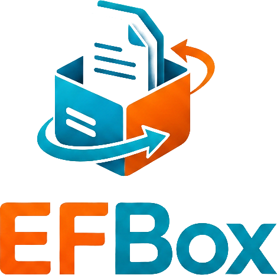

**School project, part of a web-development course.**

#   EFBox file management system
___
## Description

This project has been through a couple of version as part of various school project.

Initially it was a simple file management Java-Spring-API with no real thoughts for security.

As part of my end of education paper the Java API has been modified to respect OWASP Top 10 2025 to see  the difficulties associated with adapting an existing API to a modern security mindset. 
Since the purpose of the paper was to analyse difficulties (and honestly I was short on time) some safety aspect could have been implemented more efficiently (for example: rate limiting is actually a java class instead of a proper REDIS implementation).   

For security purposes the API can only accept WORD, EXCEL, POWERPOINT, PDF documents and images. These are validated before being saved to the database.

Files and folders can be added, renamed, deleted but no "move" function has been implemented

The _webversion_ branch has a simple but functional frontend to play around with, I've shamelessly included the .pem files. 
___
## Features

- Java Gradle with Spring Boot
- Frontend build with react, see the [ef-box-frontend project](https://github.com/eckofox1981/ef-box-frontend)
___
## Useful information
You'll need a POSTGRESQL dtabase and set up an _.env_  file using the template. 
___
## Contact
Email: [eckofox1981@pm.me](mailto:eckofox@1981@pm.me)